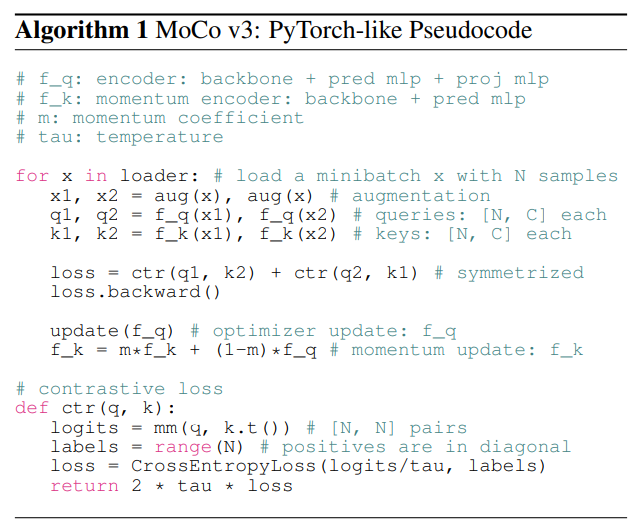

# MoCov3-pytorch
custom implementation of MoCov3 [[arxiv]](https://arxiv.org/abs/2104.02057). I implemented based on the official MoCo code base [[github]](https://github.com/facebookresearch/moco). 

For reference only. 

